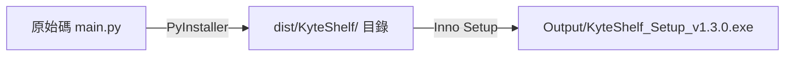

# 📦 KyteShelf 安裝檔建立指南

本文件說明如何將 KyteShelf Python 原始碼打包為獨立執行檔，並透過 Inno Setup 封裝為標準 Windows 安裝精靈（`Setup.exe`）。

---

## 🛠️ 打包完整流程



---

## 步驟 1：啟用虛擬環境

請在專案根目錄開啟 PowerShell 終端機，啟用 64 位元虛擬環境：

```powershell
.\.venv\Scripts\Activate.ps1
```

確認已安裝 PyInstaller 與專案依賴：

```powershell
pip install -r requirements.txt
pip install pyinstaller
```

---

## 步驟 2：執行 PyInstaller 打包（建立 setup.iss 所需來源）

`setup.iss` 會讀取 `dist\KyteShelf\` 資料夾作為安裝包內容來源，因此在執行 Inno Setup 前**必須先執行以下指令**：

```powershell
python -m PyInstaller --noconsole --onedir --icon=icon.ico --name=KyteShelf --clean --noconfirm main.py
```

### 參數解析：
- `--noconsole`：關閉命令提示字元黑框，以純桌面 GUI 模式運行。
- `--onedir`：打包為目錄模式，產出 `dist\KyteShelf\`（內含 `KyteShelf.exe` 與依賴函式庫 `_internal\`），冷啟動速度最快。
- `--icon=icon.ico`：嵌入專用應用程式圖示。
- `--name=KyteShelf`：指定輸出程式名稱為 `KyteShelf.exe`。
- `--clean`：清理先前的打包快取與暫存檔。
- `--noconfirm`：覆蓋既有舊輸出目錄，無需手動確認。

打包完成後，請確認目錄 `dist\KyteShelf\KyteShelf.exe` 是否已成功生成。

---

## 步驟 3：編譯 Inno Setup 腳本（產出安裝精靈）

### 方式 A：Inno Setup GUI 軟體（推薦）
1. 用 **Inno Setup Compiler** 開啟 `setup.iss`。
2. 檢查第 6 行版本號是否與目前發行版本一致：
   ```iss
   #define MyAppVersion "1.3.0"
   ```
3. 點擊頂部工具列的 **`Compile`**（綠色播放按鈕，或快捷鍵 `Ctrl + F9`）。

### 方式 B：命令列編譯（需已將 Inno Setup 加入系統 PATH）
```powershell
iscc setup.iss
```

---

## 產出結果

編譯完成後，最終安裝程式會保存在：
```text
KyteShelf/
└── Output/
    └── KyteShelf_Setup_v1.3.0.exe
```

---

## 💡 補充：單檔案免安裝綠色版 (Portable)

若不需要安裝程式，僅需要單一個獨立的 `.exe` 檔案隨點隨用，可執行：

```powershell
python -m PyInstaller --noconsole --onefile --icon=icon.ico --name=KyteShelf_Portable --clean --noconfirm main.py
```

產出檔案位於：`dist\KyteShelf_Portable.exe`
